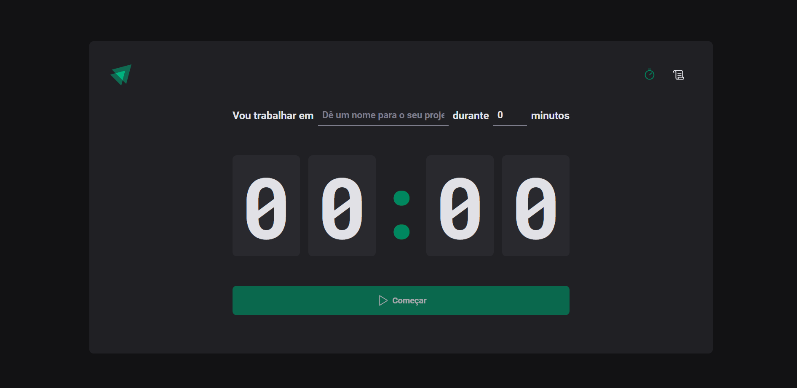
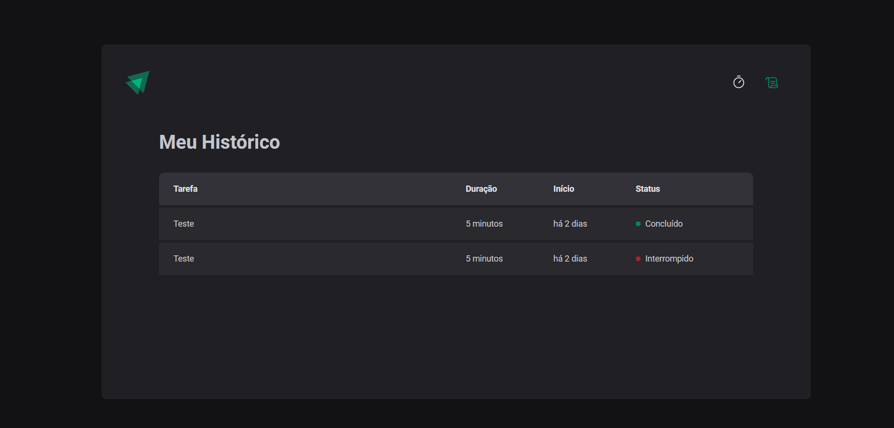

<h1 align="center">
  
</h1>

<h1 align="center">
    Ignite Timer
</h1>
<p align="center">Aplicação de um timer para criação e controle do tempo de tarefas com registro de histórico</p>


<p align="center">
  • <a href="#sobre-o-projeto">Sobre o Projeto</a>
  • <a href="#tecnologias">Tecnologias</a>
  • <a href="#configurações-necessárias">Configurações necessárias</a>
  • <a href="#licença">Licença</a>
</p>

## 🎯 Sobre o projeto

<p>
O Ignite Timer foi um projeto construído durante o módulo: Criando SPAs com React, que faz parte do programa de especialização Ignite da <a href='https://www.rocketseat.com.br/' target="_blank">Rocketseat</a>.
Neste projeto foi trabalhado conceitos importantes do react como por exemplo:

- Estados
- Imutabilidade do estado
- Listas e chaves no ReactJS
- Propriedades
- Componentização
- Context API do React

O projeto original foi desenvolvido como pratica das aulas do modulo 02 do [Ignite 2022 da Rocketseat](https://rocketseat.com.br/)
</p>

---

## 🚀 Tecnologias

Tecnologias utilizadas para construção da aplicação

- [Vite](https://vitejs.dev/)
- [React](https://reactjs.org/docs/getting-started.html)
- [TypeScript](https://www.typescriptlang.org/)
- [ESLint](https://eslint.org/)
- [Prettier](https://prettier.io/)
- [Styled Components](https://styled-components.com/)
- [React Router Dom](https://reactrouter.com/en/main),
- [React Hook Forms](https://react-hook-form.com/)
- [zod](https://zod.dev/)
- [date-fns](https://date-fns.org/)
---

## Configurações necessárias

### ✅ **Requisitos**

Necessário realizar as instalações:

- [Git](https://git-scm.com/)
- [Node](https://nodejs.org/pt-br/download/package-manager/)


*Configurações dos serviços estão localizadas no arquivo servicesConfig.md na raiz do projeto.*

### 🏁 **Clone do projeto**

```bash
# Execute o comando git clone para realizar o clone do repositório
$ git clone https://github.com/elbertej/ignite-timer.git
# Entre na pasta do repositório clonado
$ cd ignite-timer
```

### **Iniciando o projeto**

```bash
# Execute npm para instalar as dependências
$ npm i

# Para iniciar a aplicação
$ npm run dev

```

---

## Licença

Distribuído sob a licença MIT. Veja [LICENSE](LICENSE) para mais informações.

---

## Autor
Desenvolvido por [Elbert Silva](https://www.linkedin.com/in/elbert-silva-83433b118/) 👋


## Prints  
<h2>
    Timer
</h2>



<h2>
    Histórico
</h2>



